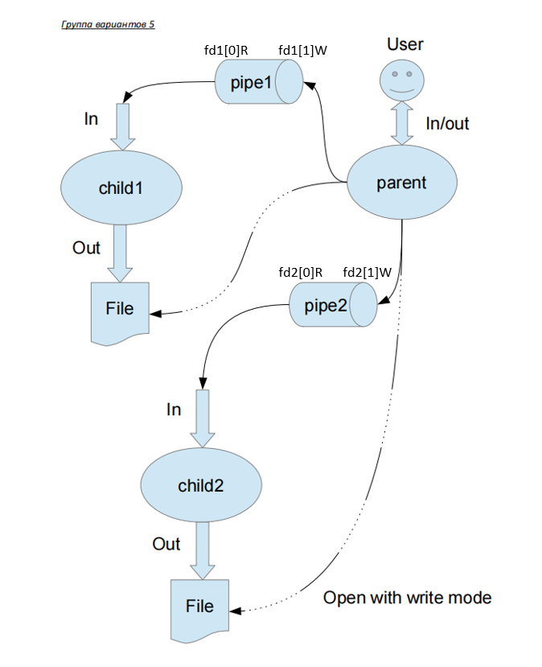

# Лабораторная работа №1

## Отчет

[Отчет в Google Documents](https://docs.google.com/document/d/1t1Opxm1Op83H5hZSpp_6Tz_WvRF9hzKU/edit?usp=sharing&ouid=106682347432010536339&rtpof=true&sd=true)

## Цель работы

Приобретение практических навыков в:
+ Управление процессами в ОС
+ Обеспечение обмена данных между процессами посредством каналов

## Задание

Составить и отладить программу на языке Си, осуществляющую работу с процессами и 
взаимодействие между ними в одной из двух операционных систем. В результате работы 
программа (основной процесс) должен создать для решение задачи один или несколько 
дочерних процессов. Взаимодействие между процессами осуществляется через системные 
сигналы/события и/или каналы (pipe).
Необходимо обрабатывать системные ошибки, которые могут возникнуть в результате работы.

## Вариант задания

Для каждого варианта приложена схема организации межпроцессорного взаимодействия.



Родительский процесс создает два дочерних процесса. Первой строкой пользователь в консоль 
родительского процесса вводит имя файла, которое будет использовано для открытия File с таким 
именем на запись для child1. Аналогично для второй строки и процесса child2. Родительский и 
дочерний процесс должны быть представлены разными программами.

Родительский процесс принимает от пользователя строки произвольной длины и пересылает их в 
pipe1 или в pipe2 в зависимости от правила фильтрации. Процесс child1 и child2 производят работу
над строками. Процессы пишут результаты своей работы в стандартный вывод.

***Вариант 22)*** Правило фильтрации: с вероятностью 80% строки отправляются в pipe1, иначе в pipe2. 
Дочерние процессы инвертируют строки.

## Как запустить?

```shell
make
./main
```